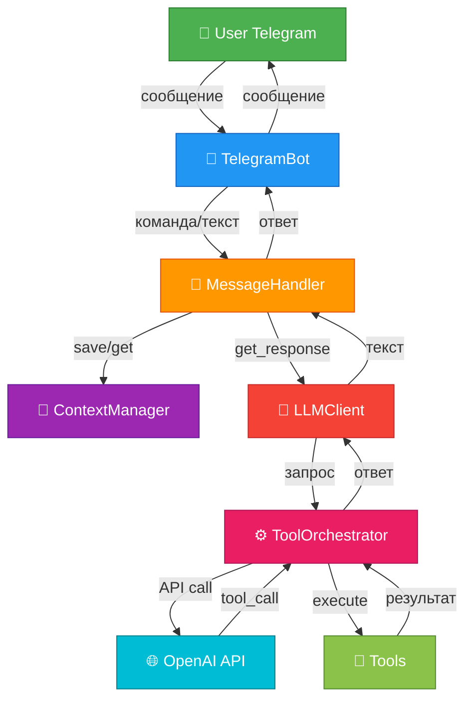
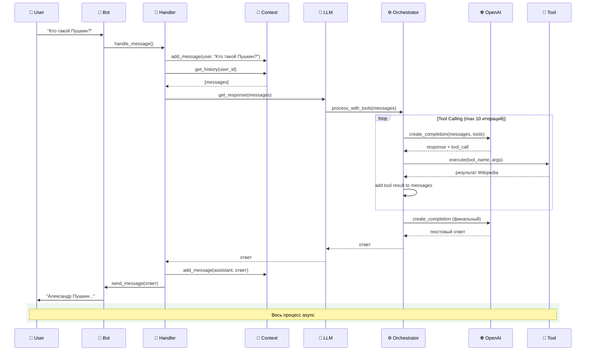
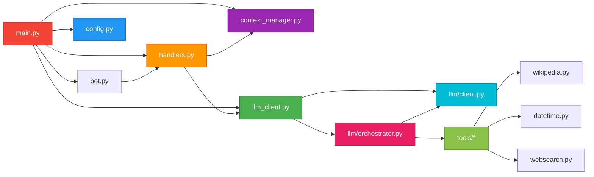
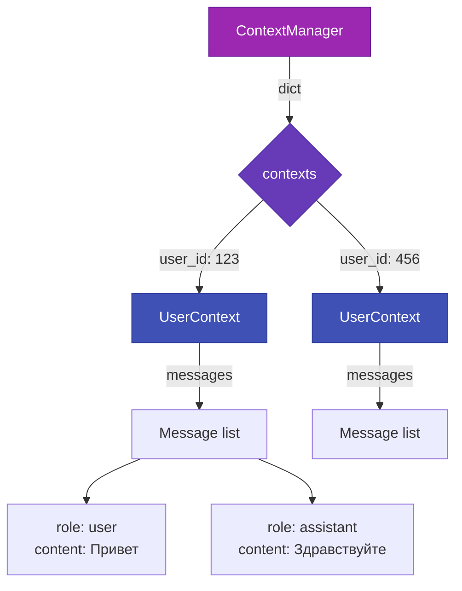

# 🏛️ Architecture Overview - Обзор архитектуры

> Высокоуровневая архитектура системы за 20 минут

---

## 🎯 Общая схема системы



---

## 📦 Основные компоненты

### 1. TelegramBot (`src/bot.py`)
**Ответственность:** Настройка aiogram, регистрация handlers

```python
Bot (aiogram) + Dispatcher + Router
↓
Регистрация handlers (start, help, role, reset, message)
↓
Infinite polling (получение обновлений)
```

### 2. MessageHandler (`src/handlers.py`)
**Ответственность:** Обработка команд и сообщений

**Команды:**
- `/start` - приветствие
- `/help` - справка
- `/role` - показать роль бота
- `/reset` - очистить историю
- текстовые сообщения - обработка через LLM

### 3. ContextManager (`src/context_manager.py`)
**Ответственность:** Управление историей диалогов

**Хранилище:** In-memory dict
```python
{
  user_id: UserContext {
    messages: [Message, Message, ...]
  }
}
```

**Лимит:** MAX_CONTEXT_MESSAGES (default: 10)

### 4. LLMClient (`src/llm_client.py`)
**Ответственность:** Фасад для работы с LLM

Делегирует работу:
- `OpenAIClient` - HTTP запросы к OpenAI API
- `ToolOrchestrator` - tool calling loop

### 5. OpenAIClient (`src/llm/client.py`)
**Ответственность:** Обертка над OpenAI API

```python
AsyncOpenAI + httpx proxy
↓
create_completion(messages, tools)
```

### 6. ToolOrchestrator (`src/llm/orchestrator.py`)
**Ответственность:** Tool calling loop

```python
for iteration in range(MAX_TOOL_ITERATIONS):
    response = openai_client.create_completion(...)
    if no tool_calls:
        return response
    execute_tools(tool_calls)
    add_tool_results_to_messages()
```

### 7. Tools (`src/tools/`)
**Ответственность:** Выполнение специфичных задач

**Интерфейс:** Protocol
```python
class Tool(Protocol):
    def get_schema() -> dict
    async def execute(**kwargs) -> str
```

**Реализации:**
- `WikipediaTool` - поиск в Wikipedia
- `DateTimeTool` - текущая дата/время
- `WebSearchTool` - поиск через DuckDuckGo

---

## 🔄 Поток обработки сообщения



---

## 🏗️ Архитектурные принципы

### KISS (Keep It Simple, Stupid)
- Минимум абстракций
- Прямолинейная логика
- Нет оверинжиниринга

**Пример:**
```python
# ✅ Просто и понятно
def handle_start(message: Message):
    await message.answer(WELCOME_TEXT)

# ❌ Не используем паттерны без необходимости
# class StartCommandFactory: ...
```

### SOLID

**Single Responsibility:**
```
OpenAIClient      - только HTTP к OpenAI
ToolOrchestrator  - только tool calling loop
WikipediaTool     - только поиск в Wikipedia
```

**Open/Closed:**
```python
# Новый tool добавляется без изменения существующих
class MyNewTool:
    def get_schema() -> dict: ...
    async def execute(**kwargs) -> str: ...
```

### DRY (Don't Repeat Yourself)

**Было (дублирование):**
```python
# Каждый tool дублировал схему в llm_client.py
```

**Стало (Protocol):**
```python
# Каждый tool сам предоставляет схему
tools_schema = [tool.get_schema() for tool in tools]
```

---

## 📊 Структура модулей



---

## 🔌 Зависимости между компонентами

### Dependency Injection

```python
# main.py
config = Config()  # Загрузка конфигурации
context_manager = ContextManager(config)
llm_client = LLMClient(config)
message_handler = MessageHandler(config, context_manager, llm_client)
bot = TelegramBot(config, message_handler)
```

**Явная передача зависимостей** - нет скрытых глобальных состояний

---

## 💾 Управление состоянием

### In-Memory Context



**⚠️ Ограничение:** Контекст теряется при перезапуске бота (приемлемо для MVP)

---

## 🛠️ Расширяемость

### Добавление нового Tool

1. Создать класс реализующий Protocol
2. Добавить в `_get_default_tools()` в `llm_client.py`

```python
# src/tools/weather.py
class WeatherTool:
    def get_schema(self) -> dict:
        return {
            "type": "function",
            "function": {
                "name": "get_weather",
                "description": "Получить погоду",
                "parameters": {...}
            }
        }

    async def execute(self, city: str) -> str:
        # API запрос к погодному сервису
        return f"Погода в {city}: +20°C"
```

**Никакие другие файлы менять не нужно!**

---

## 🔐 Безопасность и конфигурация

### Секреты через .env

```bash
TELEGRAM_BOT_TOKEN=...  # Токен бота
OPENAI_API_KEY=...      # API ключ
```

### Pydantic валидация

```python
class Config(BaseSettings):
    telegram_bot_token: str  # обязательно
    openai_api_key: str      # обязательно
    max_context_messages: int = Field(ge=1, le=50)  # лимиты
```

**При старте:** автоматическая валидация всех параметров

---

## 📈 Эволюция архитектуры

### MVP (Iter 1-7) → Рефакторинг (TechDebt 1-6)

**Было:**
```
src/
├── llm_client.py (300+ строк, делает всё)
├── wikipedia_tool.py
└── ...
```

**Стало:**
```
src/
├── llm_client.py (фасад, 80 строк)
├── llm/
│   ├── client.py (OpenAI wrapper)
│   └── orchestrator.py (tool calling)
└── tools/ (Protocol интерфейс)
```

**Результат:**
- Single Responsibility соблюден
- Легче тестировать
- Легче расширять

---

## 📊 Метрики архитектуры

| Метрика | Значение | Комментарий |
|---------|----------|-------------|
| Modules | 14 файлов | Хорошая декомпозиция |
| Слоев | 4 (Bot → Handler → LLM → Tools) | Четкая структура |
| Зависимостей | Явные | Dependency Injection |
| Coupling | Низкий | Protocol для tools |
| Cohesion | Высокий | 1 класс = 1 задача |
| Тестируемость | Высокая | 78% coverage |

---

## 🎯 Ключевые решения

### Почему in-memory?
✅ Простота реализации MVP
✅ Нет зависимости от БД
✅ Быстрая разработка

### Почему Protocol для tools?
✅ Расширяемость без изменения кода
✅ Type safety (mypy проверки)
✅ Чистая архитектура

### Почему Pydantic для Config?
✅ Автоматическая валидация
✅ Type hints out of the box
✅ Загрузка из .env

### Почему aiogram 3.x?
✅ Современный async framework
✅ Type hints support
✅ Активная разработка

---

## 📚 Дополнительно

**Детальное техническое видение:** [../vision.md](../vision.md)
**Модель данных:** [03_data_model.md](03_data_model.md)
**Интеграции:** [04_integrations.md](04_integrations.md)
**Код:** [05_codebase_tour.md](05_codebase_tour.md)


