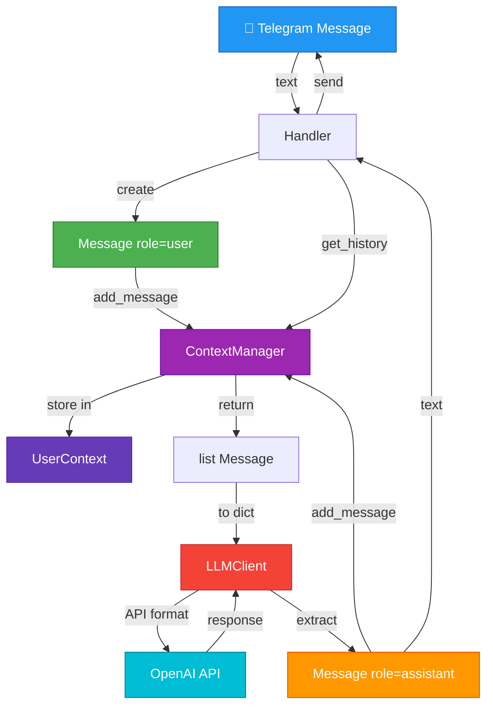

# 📊 Data Model - Модель данных

> Все Pydantic модели и структуры данных проекта

---

## 🎯 Обзор

Проект использует **Pydantic v2** для всех структур данных:
- Автоматическая валидация
- Type hints
- Сериализация/десериализация

---

## 📦 Основные модели

### 1. Message (`src/context_manager.py`)

**Назначение:** Одно сообщение в диалоге

```python
from pydantic import BaseModel
from typing import Literal

class Message(BaseModel):
    """Сообщение в диалоге."""

    role: Literal["user", "assistant", "system"]
    content: str
```

**Пример:**
```python
# Сообщение от пользователя
msg1 = Message(role="user", content="Привет!")

# Ответ ассистента
msg2 = Message(role="assistant", content="Здравствуйте!")

# Системный промпт
msg3 = Message(role="system", content="Ты полезный ассистент")
```

**Валидация:**
```python
# ❌ Ошибка: неверная роль
Message(role="admin", content="test")
# ValidationError: role must be 'user', 'assistant', or 'system'
```

---

### 2. UserContext (`src/context_manager.py`)

**Назначение:** Контекст диалога одного пользователя

```python
class UserContext(BaseModel):
    """Контекст диалога пользователя."""

    user_id: int
    messages: list[Message] = []

    def add_message(self, role: str, content: str) -> None:
        """Добавить сообщение в историю."""
        self.messages.append(Message(role=role, content=content))

    def get_messages(self, limit: int) -> list[Message]:
        """Получить последние N сообщений."""
        return self.messages[-limit:] if limit > 0 else self.messages

    def clear(self) -> None:
        """Очистить историю."""
        self.messages = []
```

**Пример:**
```python
# Создать контекст
ctx = UserContext(user_id=123456)

# Добавить сообщения
ctx.add_message("user", "Привет!")
ctx.add_message("assistant", "Здравствуйте!")
ctx.add_message("user", "Как дела?")

# Получить последние 2 сообщения
recent = ctx.get_messages(limit=2)
# [Message(role="assistant", ...), Message(role="user", ...)]

# Очистить
ctx.clear()
```

---

### 3. Config (`src/config.py`)

**Назначение:** Конфигурация приложения

```python
from pydantic_settings import BaseSettings
from pydantic import Field

class Config(BaseSettings):
    """Конфигурация приложения."""

    # Telegram
    telegram_bot_token: str = Field(..., description="Токен Telegram бота")

    # OpenAI
    openai_api_key: str = Field(..., description="API ключ OpenAI")
    openai_proxy_url: str = Field(..., description="URL прокси")
    openai_timeout: float = Field(default=30.0, ge=1.0)
    openai_model: str = Field(default="gpt-4o-mini")

    # Роль бота
    system_prompt_file: str = Field(default="prompts/default.txt")
    role_name: str = Field(default="AI Assistant")
    role_description: str = Field(default="Универсальный ИИ-ассистент")

    # Лимиты
    max_context_messages: int = Field(default=10, ge=1, le=50)
    max_tool_iterations: int = Field(default=10, ge=1, le=20)
    max_websearch_calls: int = Field(default=2, ge=1, le=5)
    max_completion_tokens: int = Field(default=10000, ge=1000)

    # Опциональные
    log_level: str = Field(default="INFO")

    # Загруженный промпт (заполняется после инициализации)
    system_prompt: str = ""

    model_config = {
        "env_file": ".env",
        "env_file_encoding": "utf-8",
        "case_sensitive": False
    }

    def __init__(self, **kwargs):
        """Инициализация с загрузкой системного промпта."""
        super().__init__(**kwargs)
        # Загрузка промпта из файла
        prompt_path = Path(self.system_prompt_file)
        if prompt_path.exists():
            self.system_prompt = prompt_path.read_text(encoding="utf-8")
```

**Пример использования:**
```python
# Загрузка из .env
config = Config()

# Доступ к параметрам
print(config.telegram_bot_token)
print(config.max_context_messages)  # 10
print(config.system_prompt)  # "Ты полезный ассистент..."

# Валидация при создании
config = Config(
    telegram_bot_token="invalid",
    max_context_messages=100  # ❌ Ошибка: max 50
)
# ValidationError: max_context_messages must be <= 50
```

---

## 🔄 Жизненный цикл данных



---

## 📝 OpenAI API форматы

### Request Messages

```python
# Формат для OpenAI API
request_messages = [
    {"role": "system", "content": config.system_prompt},
    {"role": "user", "content": "Привет!"},
    {"role": "assistant", "content": "Здравствуйте!"},
    {"role": "user", "content": "Как дела?"}
]
```

**Конвертация из Pydantic:**
```python
# Message list → dict list
messages_dict = [msg.model_dump() for msg in messages]
```

### Tool Call Format

```python
# OpenAI вызывает tool
{
    "role": "assistant",
    "content": null,
    "tool_calls": [
        {
            "id": "call_abc123",
            "type": "function",
            "function": {
                "name": "search_wikipedia",
                "arguments": '{"query": "Пушкин", "language": "ru"}'
            }
        }
    ]
}

# Результат выполнения tool
{
    "role": "tool",
    "tool_call_id": "call_abc123",
    "content": "Александр Сергеевич Пушкин (1799-1837)..."
}
```

---

## 🔧 Tool Schema Format

### Wikipedia Tool Schema

```python
{
    "type": "function",
    "function": {
        "name": "search_wikipedia",
        "description": "Поиск информации в Wikipedia",
        "parameters": {
            "type": "object",
            "properties": {
                "query": {
                    "type": "string",
                    "description": "Поисковый запрос"
                },
                "language": {
                    "type": "string",
                    "enum": ["ru", "en"],
                    "description": "Язык Wikipedia",
                    "default": "ru"
                }
            },
            "required": ["query"],
            "additionalProperties": False
        }
    }
}
```

### DateTime Tool Schema

```python
{
    "type": "function",
    "function": {
        "name": "get_current_datetime",
        "description": "Получить текущую дату и время",
        "parameters": {
            "type": "object",
            "properties": {
                "timezone": {
                    "type": "string",
                    "description": "Часовой пояс",
                    "default": "Europe/Moscow"
                },
                "format": {
                    "type": "string",
                    "enum": ["full", "date", "time"],
                    "default": "full"
                }
            },
            "additionalProperties": False
        }
    }
}
```

---

## 💾 Storage Format

### In-Memory Structure

```python
# ContextManager.contexts
contexts: dict[int, UserContext] = {
    123456: UserContext(
        user_id=123456,
        messages=[
            Message(role="user", content="Привет!"),
            Message(role="assistant", content="Здравствуйте!"),
            Message(role="user", content="Кто такой Пушкин?"),
            Message(role="assistant", content="Александр Пушкин...")
        ]
    ),
    789012: UserContext(
        user_id=789012,
        messages=[...]
    )
}
```

**Ключ:** `user_id` (int) из Telegram
**Значение:** `UserContext` с историей сообщений

---

## 🔢 Лимиты и валидация

### Context Messages Limit

```python
MAX_CONTEXT_MESSAGES = 10  # default

# При добавлении нового сообщения:
if len(context.messages) > MAX_CONTEXT_MESSAGES:
    # Удалить старые сообщения
    context.messages = context.messages[-MAX_CONTEXT_MESSAGES:]
```

### Tool Iterations Limit

```python
MAX_TOOL_ITERATIONS = 10  # default

# В ToolOrchestrator:
for iteration in range(config.max_tool_iterations):
    if iteration >= 10:
        return "Превышен лимит итераций"
```

### WebSearch Limit

```python
MAX_WEBSEARCH_CALLS = 2  # default

websearch_count = 0
if tool_name == "web_search":
    if websearch_count >= config.max_websearch_calls:
        return "Лимит веб-поиска превышен"
    websearch_count += 1
```

---

## 📋 Примеры реальных данных

### Пример 1: Простой диалог

```python
UserContext(
    user_id=123456789,
    messages=[
        Message(role="user", content="Привет!"),
        Message(role="assistant", content="Здравствуйте! Чем могу помочь?"),
        Message(role="user", content="Расскажи про Python"),
        Message(role="assistant", content="Python - язык программирования...")
    ]
)
```

### Пример 2: С использованием Wikipedia

```python
# Сообщения в OpenAI API формате
[
    {"role": "system", "content": "Ты полезный ассистент..."},
    {"role": "user", "content": "Кто такой Пушкин?"},
    {
        "role": "assistant",
        "content": null,
        "tool_calls": [{
            "function": {
                "name": "search_wikipedia",
                "arguments": '{"query": "Пушкин", "language": "ru"}'
            }
        }]
    },
    {
        "role": "tool",
        "content": "Александр Сергеевич Пушкин (1799-1837)..."
    },
    {
        "role": "assistant",
        "content": "Александр Сергеевич Пушкин - великий русский поэт..."
    }
]
```

---

## 🔍 Pydantic фишки

### Валидация

```python
# Автоматическая валидация типов
Message(role="user", content=123)  # ✅ OK, преобразуется в "123"
Message(role="admin", content="test")  # ❌ ValidationError

# Валидация диапазонов
Config(max_context_messages=100)  # ❌ ValidationError: max 50
Config(max_context_messages=5)    # ✅ OK
```

### Сериализация

```python
msg = Message(role="user", content="Hello")

# В dict
msg.model_dump()
# {'role': 'user', 'content': 'Hello'}

# В JSON
msg.model_dump_json()
# '{"role":"user","content":"Hello"}'
```

### Десериализация

```python
# Из dict
data = {"role": "user", "content": "Hello"}
msg = Message(**data)

# Из JSON
json_str = '{"role":"user","content":"Hello"}'
msg = Message.model_validate_json(json_str)
```

---

## 📚 Дополнительно

**Архитектура:** [02_architecture_overview.md](02_architecture_overview.md)
**Конфигурация:** [06_configuration.md](06_configuration.md)
**Код:** [05_codebase_tour.md](05_codebase_tour.md)
**Детали:** [../vision.md](../vision.md) раздел 5


