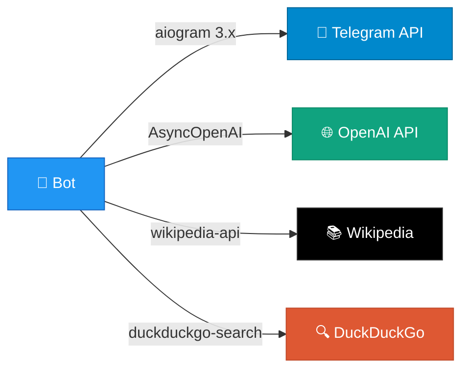
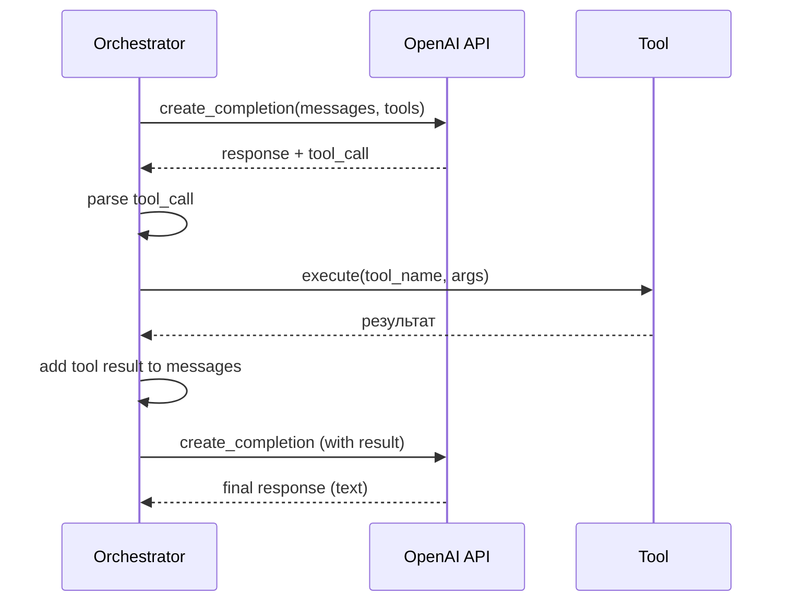

# 🔌 Integrations - Интеграции с внешними системами

> Как работают Telegram, OpenAI, Wikipedia и WebSearch

---

## 🎯 Обзор интеграций



---

## 1️⃣ Telegram Bot API

### Библиотека: aiogram 3.x

**Файлы:**
- `src/bot.py` - настройка Bot, Dispatcher, Router
- `src/handlers.py` - обработчики команд и сообщений

### Инициализация

```python
from aiogram import Bot, Dispatcher, Router
from aiogram.client.default import DefaultBotProperties
from aiogram.enums import ParseMode

# Создание бота
bot = Bot(
    token=config.telegram_bot_token,
    default=DefaultBotProperties(parse_mode=ParseMode.HTML)
)

# Dispatcher для routing
dispatcher = Dispatcher()
router = Router()
```

### Регистрация handlers

```python
# Команды
router.message(Command("start"))(handler.handle_start)
router.message(Command("help"))(handler.handle_help)
router.message(Command("role"))(handler.handle_role)
router.message(Command("reset"))(handler.handle_reset)

# Текстовые сообщения
router.message(F.text)(handler.handle_message)

# Подключение к dispatcher
dispatcher.include_router(router)
```

### Polling (получение обновлений)

```python
async def start(self) -> None:
    """Запуск бота через polling."""
    try:
        await self.dispatcher.start_polling(self.bot)
    except Exception as e:
        logger.error(f"Ошибка при запуске бота: {e}")
    finally:
        await self.bot.session.close()
```

### Отправка сообщений

```python
# Простой текст
await message.answer("Привет!")

# С HTML форматированием
await message.answer("<b>Жирный текст</b>")

# С разделением длинных сообщений
if len(text) > 4096:
    # Telegram лимит - 4096 символов
    chunks = [text[i:i+4096] for i in range(0, len(text), 4096)]
    for chunk in chunks:
        await message.answer(chunk)
```

### Типичные ошибки

```python
# NetworkError - проблемы с сетью
except aiogram.exceptions.TelegramNetworkError:
    logger.error("Сеть недоступна")

# InvalidToken - неверный токен
except aiogram.exceptions.TelegramUnauthorizedError:
    logger.error("Неверный TELEGRAM_BOT_TOKEN")
```

---

## 2️⃣ OpenAI API

### Библиотека: openai (AsyncOpenAI)

**Файлы:**
- `src/llm/client.py` - HTTP клиент к OpenAI
- `src/llm/orchestrator.py` - tool calling loop

### Инициализация с прокси

```python
import httpx
from openai import AsyncOpenAI

# HTTP клиент с прокси
http_client = httpx.AsyncClient(
    proxy=config.openai_proxy_url,  # https://api.your-proxy.com/v1
    timeout=config.openai_timeout    # 30.0 секунд
)

# OpenAI клиент
client = AsyncOpenAI(
    api_key=config.openai_api_key,
    http_client=http_client
)
```

### Создание completion

```python
response = await client.chat.completions.create(
    model=config.openai_model,        # "gpt-4o-mini"
    messages=[
        {"role": "system", "content": system_prompt},
        {"role": "user", "content": "Привет!"}
    ],
    tools=tools_schema,               # схемы доступных tools
    max_completion_tokens=10000,
)
```

### Function Calling Flow



### Обработка tool_calls

```python
message = response.choices[0].message

if message.tool_calls:
    for tool_call in message.tool_calls:
        function_name = tool_call.function.name
        arguments = json.loads(tool_call.function.arguments)

        # Выполнить tool
        result = await self._execute_tool(function_name, arguments)

        # Добавить результат в messages
        messages.append({
            "role": "tool",
            "tool_call_id": tool_call.id,
            "content": result
        })
```

### Rate Limits

```python
# OpenAI API имеет лимиты:
# - Requests per minute (RPM)
# - Tokens per minute (TPM)

try:
    response = await client.chat.completions.create(...)
except openai.RateLimitError:
    logger.error("Rate limit превышен")
    await asyncio.sleep(60)  # Подождать минуту
```

### Timeout обработка

```python
try:
    response = await client.chat.completions.create(...)
except openai.APITimeoutError:
    logger.error(f"Timeout {config.openai_timeout}s")
    return "Извините, не удалось получить ответ вовремя"
```

---

## 3️⃣ Wikipedia API

### Библиотека: wikipedia-api

**Файл:** `src/tools/wikipedia.py`

### Инициализация

```python
import wikipediaapi

# Русская Wikipedia
wiki_ru = wikipediaapi.Wikipedia(
    language='ru',
    user_agent='LLM-Assistant-Bot/1.0'
)

# Английская Wikipedia
wiki_en = wikipediaapi.Wikipedia(
    language='en',
    user_agent='LLM-Assistant-Bot/1.0'
)
```

### Поиск статьи

```python
async def search(self, query: str, language: str = "ru") -> str:
    """Поиск статьи в Wikipedia."""

    # Выбрать правильный язык
    wiki = self.wiki_ru if language == "ru" else self.wiki_en

    # Получить страницу
    page = wiki.page(query)

    if not page.exists():
        return f"Статья '{query}' не найдена"

    # Взять summary (первый абзац)
    summary = page.summary[:500]
    if len(page.summary) > 500:
        summary += "..."

    return f"{summary}\n\n🔗 Источник: {page.fullurl}"
```

### Пример использования

```python
tool = WikipediaTool()

# Поиск на русском
result = await tool.search("Пушкин", "ru")
# "Александр Сергеевич Пушкин (1799-1837)..."

# Поиск на английском
result = await tool.search("Python programming", "en")
# "Python is a high-level programming language..."
```

### Обработка ошибок

```python
try:
    page = wiki.page(query)
    if not page.exists():
        # Статья не найдена - это нормально
        return f"Статья не найдена"
except Exception as e:
    logger.error(f"Ошибка Wikipedia: {e}")
    return f"Ошибка при поиске: {str(e)}"
```

---

## 4️⃣ DuckDuckGo Search

### Библиотека: duckduckgo-search

**Файл:** `src/tools/websearch.py`

### Инициализация

```python
from duckduckgo_search import AsyncDDGS

# Async клиент
ddgs = AsyncDDGS()
```

### Поиск

```python
async def search(self, query: str, max_results: int = 3) -> str:
    """Веб-поиск через DuckDuckGo."""

    try:
        # Выполнить поиск
        results = await self.ddgs.atext(
            keywords=query,
            max_results=max_results
        )

        if not results:
            return "Ничего не найдено"

        # Форматировать результаты
        formatted = []
        for i, r in enumerate(results, 1):
            formatted.append(
                f"{i}. {r['title']}\n"
                f"   {r['body']}\n"
                f"   🔗 {r['href']}\n"
            )

        return "\n".join(formatted)

    except Exception as e:
        logger.error(f"Ошибка DuckDuckGo: {e}")
        return f"Ошибка поиска: {str(e)}"
```

### Лимиты

```python
# В ToolOrchestrator есть ограничение на количество поисков
MAX_WEBSEARCH_CALLS = 2  # default

websearch_count = 0
if function_name == "web_search":
    if websearch_count >= config.max_websearch_calls:
        return "Лимит веб-поиска превышен за один диалог"
    websearch_count += 1
```

---

## 5️⃣ DateTime (встроенный)

**Файл:** `src/tools/datetime.py`

### Получение текущего времени

```python
from datetime import datetime
import pytz

async def get_current_datetime(
    self,
    timezone: str = "Europe/Moscow",
    format: str = "full"
) -> str:
    """Получить текущую дату и время."""

    # Получить timezone
    tz = pytz.timezone(timezone)
    now = datetime.now(tz)

    # Форматировать
    if format == "date":
        return now.strftime("%d.%m.%Y")
    elif format == "time":
        return now.strftime("%H:%M:%S")
    else:  # full
        return now.strftime("%d.%m.%Y %H:%M:%S %Z")
```

---

## 🔧 Моки для тестирования

### Mock OpenAI

```python
# tests/test_llm_client.py
from unittest.mock import AsyncMock, MagicMock

@pytest.mark.asyncio
async def test_llm_client():
    # Mock OpenAI response
    mock_response = MagicMock()
    mock_response.choices = [
        MagicMock(
            message=MagicMock(
                content="Test response",
                tool_calls=None
            )
        )
    ]

    # Inject mock
    client.openai_client.client.chat.completions.create = AsyncMock(
        return_value=mock_response
    )
```

### Mock Wikipedia

```python
# tests/test_wikipedia_tool.py
@pytest.mark.asyncio
async def test_wikipedia_search(monkeypatch):
    # Mock wikipediaapi
    mock_page = MagicMock()
    mock_page.exists.return_value = True
    mock_page.summary = "Test summary"
    mock_page.fullurl = "https://test.url"

    # Inject mock
    monkeypatch.setattr(tool.wiki_ru, 'page', lambda q: mock_page)
```

---

## 📊 Мониторинг интеграций

### Логирование

```python
# Все интеграции логируют важные события:

logger.info(f"Запрос к OpenAI: {len(messages)} сообщений")
logger.info(f"Поиск в Wikipedia: '{query}' ({language})")
logger.info(f"Веб-поиск: '{query}'")
logger.error(f"Ошибка OpenAI API: {e}")
```

### Метрики (текущая реализация)

```python
# В логах можно отслеживать:
# - Количество запросов к каждой интеграции
# - Время выполнения
# - Частоту ошибок
```

---

## ⚠️ Типичные проблемы

### OpenAI Proxy недоступен

**Симптом:**
```
ERROR | Ошибка OpenAI API: Connection timeout
```

**Решение:**
```bash
# Проверить доступность прокси
curl -I $OPENAI_PROXY_URL

# Проверить .env
cat .env | grep OPENAI_PROXY_URL
```

### Wikipedia статья не найдена

**Симптом:**
```
INFO | Wikipedia: Статья 'xyz' не найдена
```

**Это нормально!** Wikipedia может не иметь статьи. LLM получит это сообщение и скажет пользователю.

### DuckDuckGo rate limit

**Симптом:**
```
ERROR | DuckDuckGo: Rate limit exceeded
```

**Решение:** Подождать или уменьшить частоту запросов

---

## 📚 Дополнительно

**Архитектура:** [02_architecture_overview.md](02_architecture_overview.md)
**Модель данных:** [03_data_model.md](03_data_model.md)
**Тестирование:** [08_testing_guide.md](08_testing_guide.md)
**Troubleshooting:** [10_troubleshooting.md](10_troubleshooting.md)


