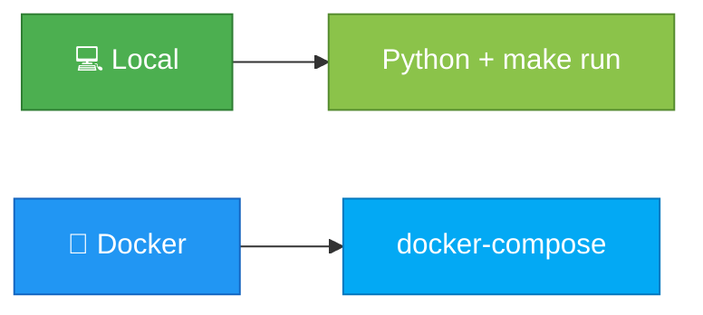
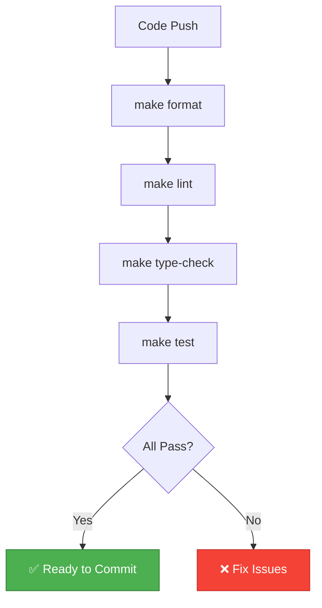

# 🚀 Deployment - Деплой и запуск

> Как запустить проект локально и в production

---

## 🎯 Способы запуска



---

## 💻 Локальный запуск

### Prerequisites

```bash
# Python 3.12+
python --version
# Output: Python 3.12.x

# uv установлен
uv --version
# Output: uv 0.x.x
```

---

### Установка зависимостей

```bash
# Первый раз
uv sync

# Обновление зависимостей
uv sync --upgrade
```

---

### Настройка .env

```bash
# Создать из шаблона
cp .env.example .env

# Заполнить обязательные параметры
nano .env
```

**Обязательно:**
- `TELEGRAM_BOT_TOKEN`
- `OPENAI_API_KEY`
- `OPENAI_PROXY_URL`

---

### Запуск

```bash
# Через Makefile
make run

# Напрямую
uv run python -m src.main
```

**Вывод при успешном запуске:**
```
2025-10-16 14:23:15 | INFO | === Запуск LLM-ассистента ===
2025-10-16 14:23:15 | INFO | Модель: gpt-4o-mini
2025-10-16 14:23:16 | INFO | Бот запущен: @your_bot
2025-10-16 14:23:16 | INFO | Start polling
```

---

### Остановка

```bash
# В терминале с ботом
Ctrl + C

# Вывод:
# INFO | Бот остановлен пользователем
```

---

## 🐳 Docker (в разработке)

> ⚠️ **Примечание:** Docker конфигурация планируется в Iteration 9

### Структура (будущая)

```
Dockerfile              # Multi-stage образ
docker-compose.yml      # Конфигурация сервисов
.dockerignore          # Исключения для Docker
```

---

### Dockerfile (планируется)

```dockerfile
# Stage 1: Builder
FROM python:3.12-slim AS builder

# Установка uv
COPY --from=ghcr.io/astral-sh/uv:latest /uv /usr/local/bin/uv

WORKDIR /app
COPY pyproject.toml uv.lock* ./
RUN uv sync --frozen --no-dev

# Stage 2: Runtime
FROM python:3.12-slim

RUN useradd -m -u 1000 botuser
WORKDIR /app

COPY --from=builder /usr/local/lib/python3.12/site-packages /usr/local/lib/python3.12/site-packages
COPY --chown=botuser:botuser src/ ./src/
COPY --chown=botuser:botuser prompts/ ./prompts/

USER botuser
CMD ["python", "-m", "src.main"]
```

---

### docker-compose.yml (планируется)

```yaml
version: '3.8'

services:
  bot:
    build:
      context: .
      dockerfile: Dockerfile
    container_name: llm-bot
    restart: unless-stopped

    env_file: .env

    # Или через environment:
    environment:
      - TELEGRAM_BOT_TOKEN=${TELEGRAM_BOT_TOKEN}
      - OPENAI_API_KEY=${OPENAI_API_KEY}
      - OPENAI_PROXY_URL=${OPENAI_PROXY_URL}
      - LOG_LEVEL=${LOG_LEVEL:-INFO}

    deploy:
      resources:
        limits:
          cpus: '1.0'
          memory: 512M

    logging:
      driver: "json-file"
      options:
        max-size: "10m"
        max-file: "3"
```

---

### Команды Docker (будущие)

```bash
# Сборка
docker-compose build

# Запуск
docker-compose up -d

# Логи
docker-compose logs -f bot

# Остановка
docker-compose down

# Перезапуск
docker-compose restart bot
```

---

## 🔧 CI/CD (текущее состояние)

### Локальная проверка перед push

```bash
# Полная проверка
make check
# Выполняет:
# 1. make lint       (ruff)
# 2. make type-check (mypy)
# 3. make test       (pytest + coverage)

# Вывод при успехе:
# ✓ Lint passed
# ✓ Type check passed
# ✓ 55 tests passed
# ✓ Coverage: 78%
```

---

### Что проверяется



---

## 📊 Мониторинг

### Логи

**Local:**
```bash
# Логи в stdout
make run
# Все логи в терминале
```

**Log Level:**
```bash
# .env
LOG_LEVEL=INFO    # Основные события
LOG_LEVEL=DEBUG   # Детальная отладка
LOG_LEVEL=ERROR   # Только ошибки
```

---

### Структура логов

```
TIMESTAMP | LEVEL | MODULE | MESSAGE

2025-10-16 14:23:15 | INFO | src.main | Запуск бота
2025-10-16 14:23:20 | INFO | src.handlers | Сообщение от user 123
2025-10-16 14:23:21 | ERROR | src.llm_client | OpenAI timeout
```

---

## 🔒 Секреты в Production

### Environment Variables

```bash
# Production .env
TELEGRAM_BOT_TOKEN=prod_token
OPENAI_API_KEY=prod_key
OPENAI_PROXY_URL=https://prod-proxy.com/v1
LOG_LEVEL=INFO
```

**⚠️ Важно:**
- Не коммитить `.env`
- Использовать секреты менеджер
- Разные токены для dev/prod

---

## 📈 Performance

### Ресурсы

**Минимум:**
- CPU: 0.5 core
- RAM: 256 MB
- Disk: 100 MB

**Рекомендуемо:**
- CPU: 1 core
- RAM: 512 MB
- Disk: 500 MB

---

### Лимиты

```bash
# .env
MAX_CONTEXT_MESSAGES=10      # Память на пользователя
MAX_TOOL_ITERATIONS=10       # CPU на запрос
MAX_WEBSEARCH_CALLS=2        # Внешние запросы
```

---

## 🔄 Обновление

### Локально

```bash
# 1. Остановить бота
Ctrl + C

# 2. Обновить код
git pull origin main

# 3. Обновить зависимости
uv sync

# 4. Запустить
make run
```

---

### Docker (будущее)

```bash
# 1. Пересобрать образ
docker-compose build

# 2. Перезапустить
docker-compose up -d

# 3. Проверить логи
docker-compose logs -f bot
```

---

## 🧪 Pre-deploy чек-лист

### Перед деплоем

- [ ] Все тесты проходят (`make test`)
- [ ] Линтер проходит (`make lint`)
- [ ] Type checker проходит (`make type-check`)
- [ ] Coverage >= 78%
- [ ] `.env` файл настроен
- [ ] Секреты не закоммичены
- [ ] Документация актуальна
- [ ] CHANGELOG обновлен

---

### После деплоя

- [ ] Бот отвечает на `/start`
- [ ] Бот отвечает на обычные сообщения
- [ ] Wikipedia tool работает
- [ ] WebSearch tool работает
- [ ] Логи без ошибок
- [ ] Команда `/role` показывает правильную роль

---

## 🚨 Rollback

### Локально

```bash
# Откат на предыдущую версию
git checkout <previous-commit>
uv sync
make run
```

---

### Процедура при проблемах

1. **Остановить бота:** `Ctrl + C` или `docker-compose down`
2. **Проверить логи:** Последние ошибки
3. **Откатиться:** К последней рабочей версии
4. **Исправить:** В отдельной ветке
5. **Протестировать:** `make check`
6. **Задеплоить:** Снова

---

## 📚 Дополнительно

**Getting Started:** [01_getting_started.md](01_getting_started.md)
**Configuration:** [06_configuration.md](06_configuration.md)
**Troubleshooting:** [10_troubleshooting.md](10_troubleshooting.md)
**Vision (Docker):** [../vision.md](../vision.md) раздел 10


