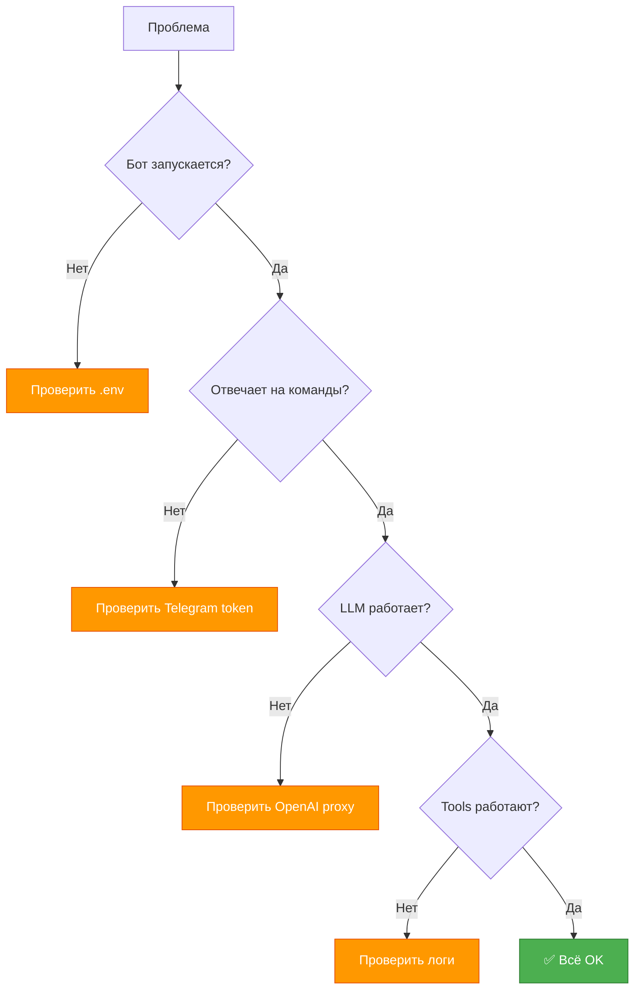

# 🔧 Troubleshooting - Решение проблем

> Быстрые решения типичных проблем

---

## ⚡ Быстрая диагностика



---

## 🚫 Проблемы при запуске

### Ошибка: "TELEGRAM_BOT_TOKEN not found"

**Симптом:**
```
ValidationError: Field required [type=missing, input_value=...]
```

**Решение:**

```bash
# 1. Проверить существование .env
ls -la .env

# 2. Проверить содержимое
cat .env | grep TELEGRAM_BOT_TOKEN

# 3. Если нет - создать
cp .env.example .env
nano .env
# Заполнить TELEGRAM_BOT_TOKEN=...
```

---

### Ошибка: "Python version 3.12 required"

**Симптом:**
```
ERROR: Python 3.11 found, 3.12+ required
```

**Решение:**

```bash
# Проверить версию Python
python --version

# Установить Python 3.12
# Windows: https://python.org/downloads/
# Linux: sudo apt install python3.12
# macOS: brew install python@3.12

# Или использовать pyenv
pyenv install 3.12
pyenv local 3.12
```

---

### Ошибка: "uv: command not found"

**Симптом:**
```bash
make run
# bash: uv: command not found
```

**Решение:**

```bash
# Установить uv
# Linux/macOS:
curl -LsSf https://astral.sh/uv/install.sh | sh

# Windows (PowerShell):
powershell -c "irm https://astral.sh/uv/install.ps1 | iex"

# Проверить
uv --version
```

---

### Ошибка: "ModuleNotFoundError: No module named 'src'"

**Симптом:**
```
ModuleNotFoundError: No module named 'src'
```

**Решение:**

```bash
# 1. Убедиться что зависимости установлены
uv sync

# 2. Запускать через uv run
uv run python -m src.main

# 3. Или использовать make
make run
```

---

## 🤖 Проблемы с Telegram ботом

### Бот не отвечает на сообщения

**Симптомы:**
- Бот запустился
- Логи показывают "Start polling"
- Но не отвечает в Telegram

**Диагностика:**

```bash
# Проверить логи
# Должны быть строки:
# INFO | src.handlers | Сообщение от пользователя 123456
```

**Решение:**

```bash
# 1. Проверить что токен правильный
python -c "
from src.config import Config
c = Config()
print(f'Token: {c.telegram_bot_token[:10]}...')
"

# 2. Проверить что бот активен в @BotFather
# Отправить @BotFather команду: /mybots

# 3. Перезапустить бота
Ctrl + C
make run
```

---

### Ошибка: "Unauthorized"

**Симптом:**
```
TelegramUnauthorizedError: Unauthorized
```

**Решение:**

```bash
# Неверный TELEGRAM_BOT_TOKEN
# 1. Получить новый токен от @BotFather
#    /token в чате с @BotFather

# 2. Обновить .env
nano .env
# TELEGRAM_BOT_TOKEN=новый_токен

# 3. Перезапустить
make run
```

---

## 🌐 Проблемы с OpenAI API

### Ошибка: "Connection timeout"

**Симптом:**
```
ERROR | src.llm_client | OpenAI API timeout
```

**Решение:**

```bash
# 1. Проверить доступность прокси
curl -I $OPENAI_PROXY_URL
# Должен вернуть HTTP 200 или 404

# 2. Проверить .env
cat .env | grep OPENAI_PROXY_URL

# 3. Увеличить timeout
# .env
OPENAI_TIMEOUT=60.0

# 4. Проверить интернет соединение
ping 8.8.8.8
```

---

### Ошибка: "Rate limit exceeded"

**Симптом:**
```
openai.RateLimitError: Rate limit exceeded
```

**Решение:**

```bash
# 1. Подождать минуту
# 2. Уменьшить частоту запросов
# 3. Проверить квоту на platform.openai.com
# 4. Использовать другой API key
```

---

### Ошибка: "Invalid API key"

**Симптом:**
```
openai.AuthenticationError: Invalid API key
```

**Решение:**

```bash
# 1. Проверить ключ
cat .env | grep OPENAI_API_KEY

# 2. Получить новый на platform.openai.com/api-keys

# 3. Обновить .env
nano .env
# OPENAI_API_KEY=новый_ключ

# 4. Перезапустить
make run
```

---

## 🔧 Проблемы с Tools

### Wikipedia: "Статья не найдена"

**Симптом:**
```
INFO | Wikipedia: Статья 'xyz' не найдена
```

**Это нормально!** Wikipedia может не иметь статьи по запросу.

**Решение:** Никакого. LLM получит это сообщение и скажет пользователю.

---

### DuckDuckGo: "Rate limit"

**Симптом:**
```
ERROR | DuckDuckGo: Rate limit exceeded
```

**Решение:**

```bash
# 1. Подождать 10-15 минут
# 2. Уменьшить MAX_WEBSEARCH_CALLS
# .env
MAX_WEBSEARCH_CALLS=1

# 3. Использовать реже веб-поиск
```

---

## 🧪 Проблемы с тестами

### Тесты падают после обновления

**Симптом:**
```
FAILED tests/test_config.py::test_config_loads_from_env
```

**Решение:**

```bash
# 1. Проверить что .env не мешает тестам
# tests используют kwargs, не .env

# 2. Очистить кэш
make clean

# 3. Переустановить зависимости
uv sync

# 4. Запустить снова
make test
```

---

### Coverage упал

**Симптом:**
```
TOTAL    320    437    73%  (было 78%)
```

**Решение:**

```bash
# 1. Найти непокрытые строки
pytest --cov=src --cov-report=term-missing

# 2. Добавить тесты для новых функций

# 3. Проверить покрытие снова
make test
```

---

## 🐛 Отладка

### Включить DEBUG логи

```bash
# .env
LOG_LEVEL=DEBUG

# Перезапустить
make run

# Вывод:
# DEBUG | src.llm_client | Запрос к OpenAI: 3 сообщения
# DEBUG | src.llm_client | Tool call: search_wikipedia
```

---

### Использовать breakpoint

```python
# В коде где нужна отладка
import pdb; pdb.set_trace()

# Запустить
python -m src.main

# Остановится на breakpoint
# (Pdb) print(variable)
# (Pdb) continue
```

---

## 📋 Чек-листы

### Бот не работает

- [ ] `.env` файл существует
- [ ] Все обязательные параметры заполнены
- [ ] Python 3.12+ установлен
- [ ] `uv sync` выполнен
- [ ] `make test` проходит
- [ ] Логи не показывают ошибок
- [ ] Токен Telegram правильный
- [ ] OpenAI proxy доступен

---

### LLM не отвечает

- [ ] OPENAI_API_KEY правильный
- [ ] OPENAI_PROXY_URL доступен
- [ ] Интернет соединение работает
- [ ] Нет rate limit ошибок
- [ ] Timeout достаточный (30+ сек)
- [ ] Логи показывают запросы к API

---

## 🔍 Логи

### Где искать логи

**Local:**
```bash
# В терминале где запущен бот
make run
# Все логи здесь
```

**Docker (будущее):**
```bash
docker-compose logs -f bot
```

---

### Типичные ошибки в логах

```bash
# Ошибка API
ERROR | src.llm_client | OpenAI API timeout
→ Проверить OPENAI_PROXY_URL

# Ошибка Telegram
ERROR | src.bot | Unauthorized
→ Проверить TELEGRAM_BOT_TOKEN

# Ошибка конфигурации
ERROR | src.config | Field required
→ Проверить .env

# Ошибка tool
ERROR | src.tools.websearch | Rate limit
→ Подождать или уменьшить лимит
```

---

## ❓ FAQ

### Q: Бот перестал помнить контекст?

**A:** Контекст in-memory, теряется при перезапуске. Это нормально для текущей версии.

---

### Q: Можно ли использовать без прокси?

**A:** Зависит от региона. Попробуйте:
```bash
OPENAI_PROXY_URL=https://api.openai.com/v1
```

---

### Q: Как поменять модель?

**A:** Обновить `.env`:
```bash
OPENAI_MODEL=gpt-4o  # или gpt-4-turbo, gpt-3.5-turbo
```

---

### Q: Бот отвечает долго?

**A:**
1. Уменьшить MAX_CONTEXT_MESSAGES
2. Использовать более быструю модель (gpt-4o-mini)
3. Увеличить OPENAI_TIMEOUT

---

### Q: Как очистить историю всех пользователей?

**A:** Перезапустить бота (контекст in-memory)

---

## 🆘 Куда обращаться

### Документация

1. **Getting Started:** [01_getting_started.md](01_getting_started.md)
2. **Configuration:** [06_configuration.md](06_configuration.md)
3. **Vision:** [../vision.md](../vision.md)

---

### Известные ограничения

- ⚠️ Контекст теряется при перезапуске (in-memory)
- ⚠️ Нет персистентности БД
- ⚠️ Лимит Telegram: 4096 символов на сообщение
- ⚠️ OpenAI API rate limits

---

## 🔧 Быстрые фиксы

### Полная переустановка

```bash
# 1. Очистить всё
make clean
rm -rf .venv uv.lock

# 2. Переустановить
uv sync

# 3. Проверить
make test

# 4. Запустить
make run
```

---

### Сброс конфигурации

```bash
# 1. Удалить .env
rm .env

# 2. Создать заново
cp .env.example .env

# 3. Заполнить
nano .env

# 4. Проверить
python -c "from src.config import Config; Config()"
```

---

**Не нашли решение?** Проверьте логи, они подскажут! 🔍


