# 🎨 Visual Architecture - Визуальная архитектура проекта

> Комплексная визуализация с разных точек зрения

---

## 📋 Содержание

1. [High-Level Architecture](#1-high-level-architecture)
2. [Component Structure](#2-component-structure)
3. [Data Flow](#3-data-flow)
4. [Class Diagram](#4-class-diagram)
5. [Integration View](#5-integration-view)
6. [State Management](#6-state-management)
7. [Message Processing Pipeline](#7-message-processing-pipeline)
8. [Tool Calling Flow](#8-tool-calling-flow)
9. [Deployment View](#9-deployment-view)
10. [Development Workflow](#10-development-workflow)
11. [Testing Structure](#11-testing-structure)
12. [Dependencies Graph](#12-dependencies-graph)

---

## 1️⃣ High-Level Architecture

### Общая архитектура системы

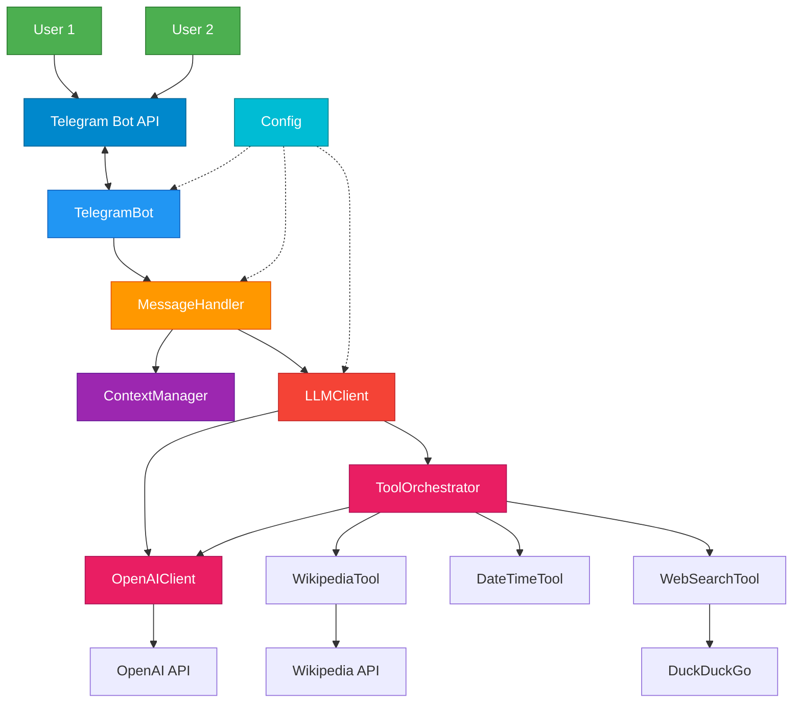

---

## 2️⃣ Component Structure

### Структура модулей и зависимости

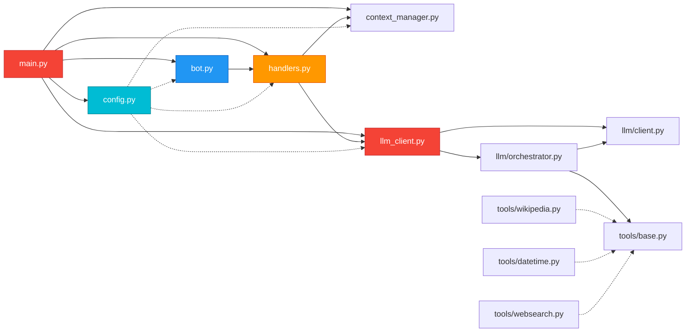

---

## 3️⃣ Data Flow

### Поток данных через систему

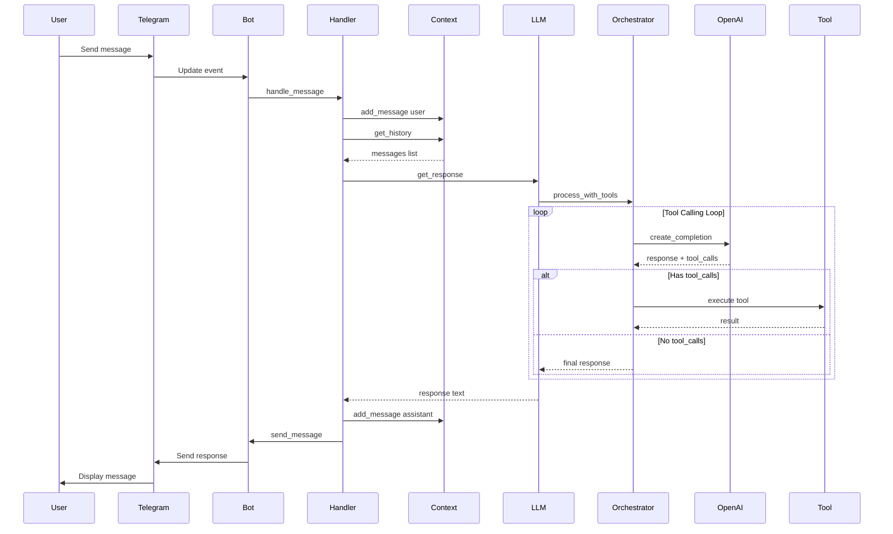

---

## 4️⃣ Class Diagram

### Структура классов и их взаимосвязи

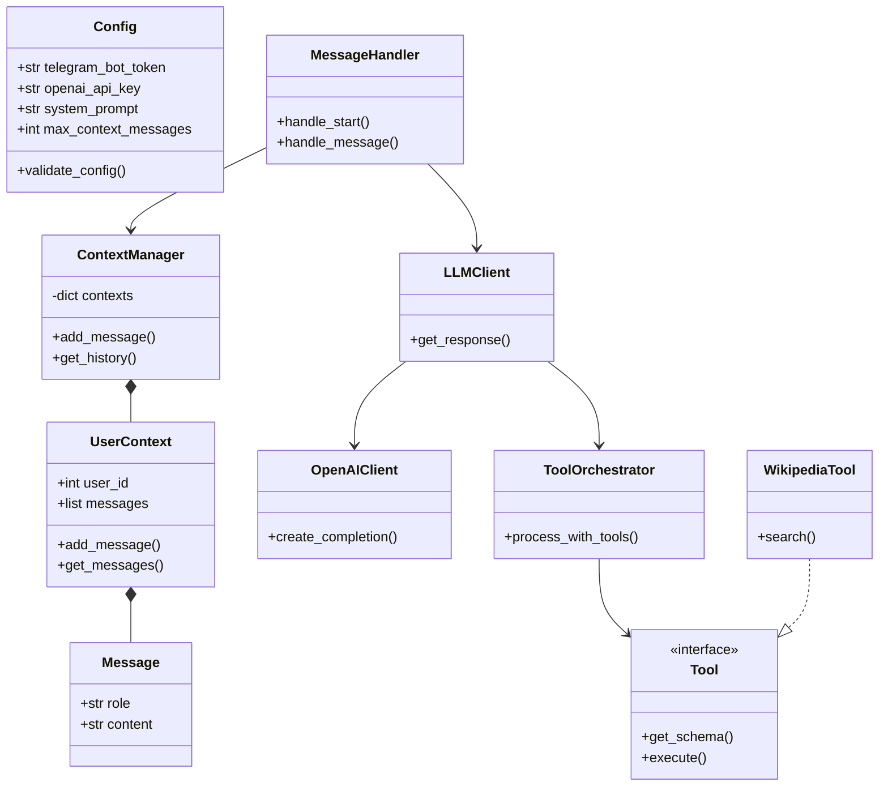

---

## 5️⃣ Integration View

### Внешние интеграции

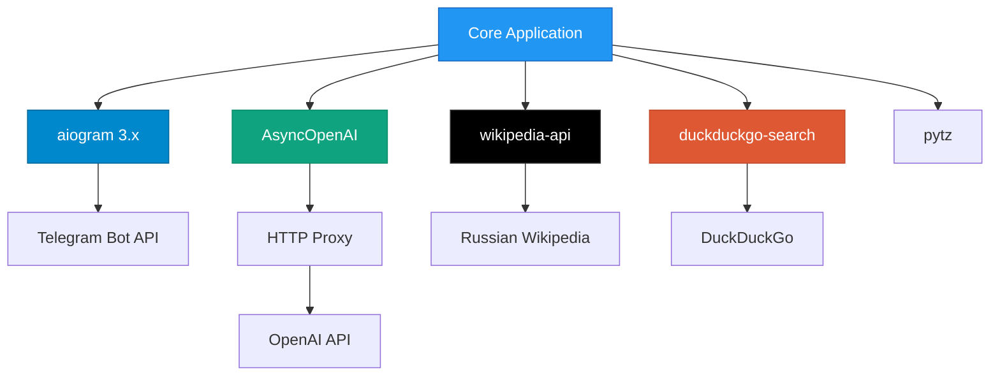

---

## 6️⃣ State Management

### Управление состоянием диалога

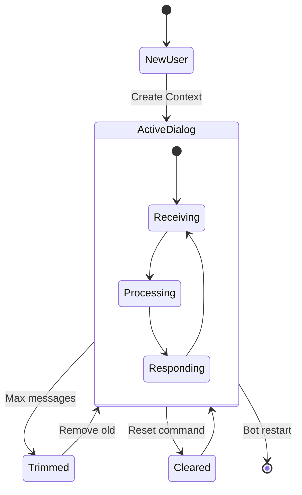

---

## 7️⃣ Message Processing Pipeline

### Пайплайн обработки сообщения

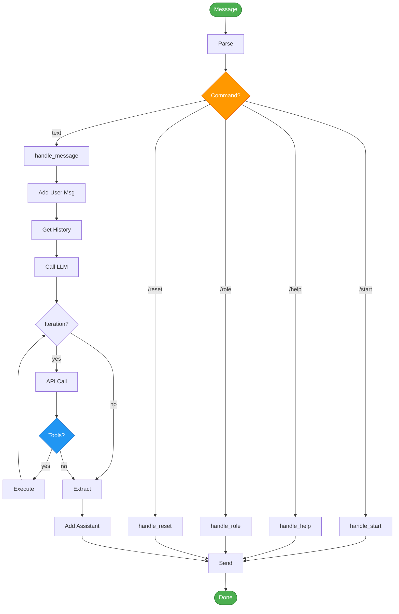

---

## 8️⃣ Tool Calling Flow

### Детальный flow вызова tools

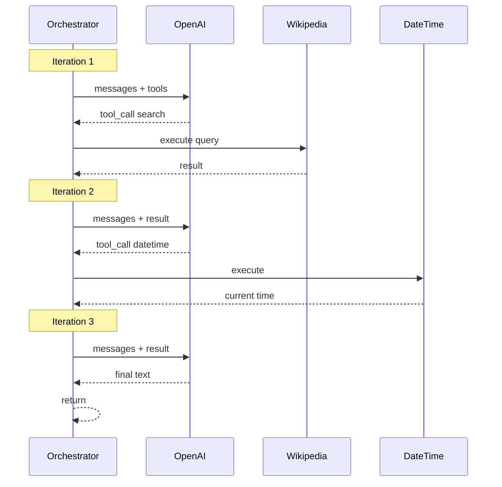

---

## 9️⃣ Deployment View

### Архитектура развертывания

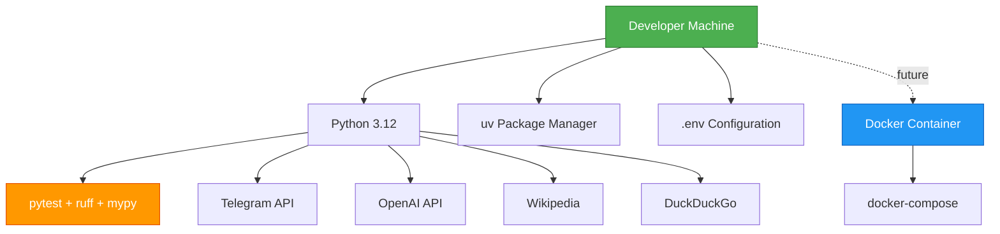

---

## 🔟 Development Workflow

### Процесс разработки TDD

```mermaid
flowchart LR
    RED[Write Test]
    GREEN[Write Code]
    REFACTOR[Refactor]

    Format[Format]
    Lint[Lint]
    Type[Type Check]
    Test[Run Tests]

    Branch[Branch]
    Commit[Commit]
    Push[Push]
    Review[Review]
    Merge[Merge]

    RED --> GREEN
    GREEN --> REFACTOR
    REFACTOR --> Format
    Format --> Lint
    Lint --> Type
    Type --> Test
    Test --> Branch
    Branch --> Commit
    Commit --> Push
    Push --> Review
    Review --> Merge
    Merge -.-> RED

    style RED fill:#F44336,stroke:#C62828,color:#fff
    style GREEN fill:#4CAF50,stroke:#2E7D32,color:#fff
    style REFACTOR fill:#2196F3,stroke:#1565C0,color:#fff
    style Merge fill:#9C27B0,stroke:#6A1B9A,color:#fff
```

---

## 1️⃣1️⃣ Testing Structure

### Покрытие тестами по модулям

**Общее покрытие: 78%**

| Модуль | Coverage | Статус |
|--------|----------|--------|
| context_manager.py | 100% | ✅ Excellent |
| llm_client.py | 100% | ✅ Excellent |
| config.py | 96% | ✅ Great |
| handlers.py | 93% | ✅ Great |
| wikipedia.py | 92% | ✅ Great |
| orchestrator.py | 87% | ✅ Good |
| websearch.py | 83% | ✅ Good |
| datetime.py | 82% | ✅ Good |
| client.py | 72% | ⚠️ Needs work |
| bot.py | 0% | ❌ Not covered |
| main.py | 0% | ❌ Not covered |

### Тестовая пирамида

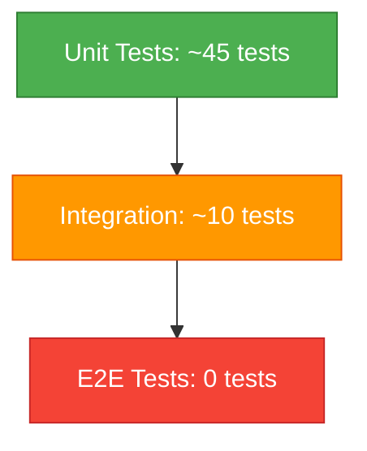

**Всего: 55 тестов, 0 failed ✅**

---

## 1️⃣2️⃣ Dependencies Graph

### Граф зависимостей проекта

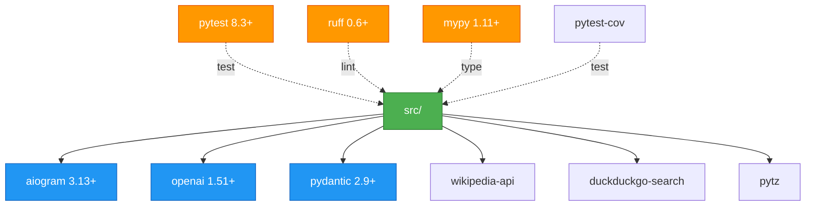

---

## 🎯 Project Metrics

### Ключевые метрики проекта

| Категория | Метрика | Значение |
|-----------|---------|----------|
| **Code** | Модулей | 14 |
| **Code** | Строк кода | ~2000 |
| **Code** | Файлов | 23 |
| **Tests** | Тестов | 55 |
| **Tests** | Coverage | 78% |
| **Tests** | Failed | 0 |
| **Quality** | ruff | ✅ Pass |
| **Quality** | mypy | ✅ Pass |
| **Progress** | MVP | 7/9 iterations |
| **Progress** | TechDebt | 6/6 done |

---

## 📊 Architecture Patterns

### Используемые паттерны

| Паттерн | Где используется | Зачем |
|---------|------------------|-------|
| **Facade** | LLMClient | Упрощение работы с LLM |
| **Protocol** | Tool interface | Расширяемость tools |
| **Dependency Injection** | Config → все | Явные зависимости |
| **Repository** | ContextManager | Управление данными |
| **Strategy** | Tools | Разные стратегии поиска |

---

## 📚 Легенда цветов

| Цвет | Hex | Использование |
|------|-----|---------------|
| 🟢 Зеленый | #4CAF50 | Users, Success, Good |
| 🔵 Синий | #2196F3 | Core components |
| 🟣 Фиолетовый | #9C27B0 | Storage, State |
| 🟠 Оранжевый | #FF9800 | Handlers, Dev tools |
| 🔴 Красный | #F44336 | LLM, Critical, Bad |
| 🔴 Розовый | #E91E63 | Orchestration |
| 🔵 Голубой | #00BCD4 | Configuration |
| ⚫ Черный | #000000 | Wikipedia |
| 🟤 Коричневый | #de5833 | DuckDuckGo |

---

## 🔗 Связанные гайды

- **Architecture Overview:** [02_architecture_overview.md](02_architecture_overview.md)
- **Data Model:** [03_data_model.md](03_data_model.md)
- **Integrations:** [04_integrations.md](04_integrations.md)
- **Codebase Tour:** [05_codebase_tour.md](05_codebase_tour.md)
- **Development Workflow:** [07_development_workflow.md](07_development_workflow.md)

---

**Назначение диаграмм:**
- 📊 **Презентации** - показать архитектуру stakeholders
- 📝 **Документация** - визуализация технических решений
- 🎓 **Онбординг** - быстрое понимание системы
- 🔍 **Анализ** - поиск узких мест и возможностей рефакторинга
- 🗣️ **Коммуникация** - обсуждение архитектуры в команде
